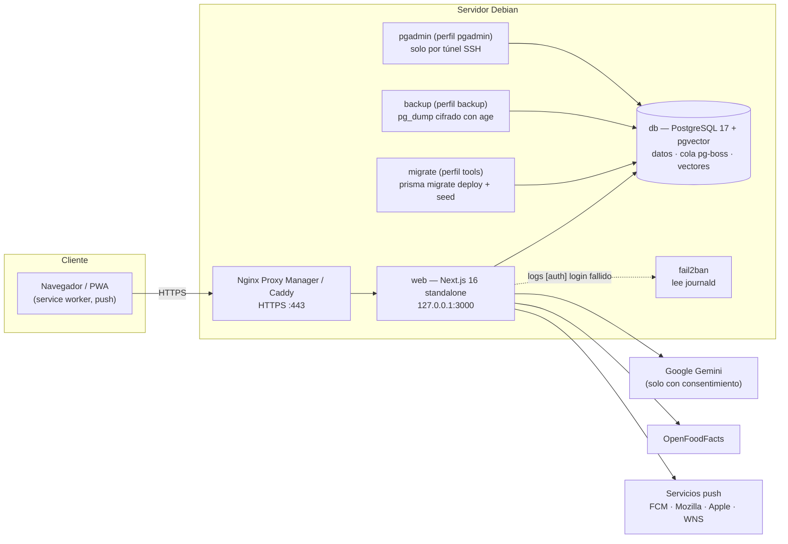
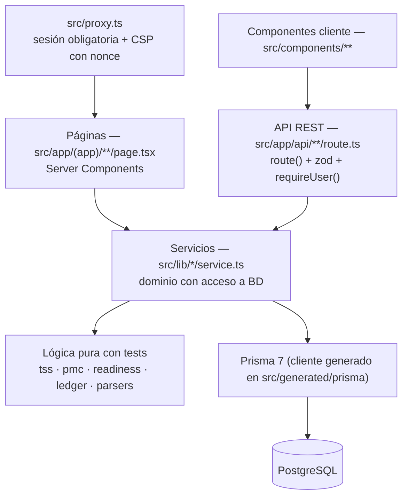

# Atlenza — Arquitectura

Visión de conjunto: qué piezas hay, cómo viajan los datos y por qué se tomó cada decisión importante. El detalle (API, fórmulas de carga, RAG) está en [`manual_backend.md`](../manual_backend.md), y el despliegue en [`manual_docker_debian.md`](../manual_docker_debian.md).

## Servicios en producción

`web` lleva todo dentro de un mismo proceso Node:

- las páginas (Server Components) y la API REST;
- el **planificador**: tareas horarias en `src/lib/scheduler.ts`, arrancadas desde `src/instrumentation.ts`;
- el **trabajador de la cola** de ingesta de apuntes (pg-boss sobre la misma PostgreSQL; sin Redis).

## Capas del código

- **Leer:** las páginas llaman a los servicios directamente, sin pasar por HTTP.
- **Escribir:** los componentes cliente llaman a la API y después `router.refresh()`.
- **Lógica pura** (sin BD ni red): cálculo de carga, contabilidad, troceado de texto, SM-2 y lectores de ficheros (FIT/GPX/TCX, CSV/Norma 43, plan en PDF). Es lo que más tests tiene.

## Flujos de datos principales

**Registrar una sesión.**

1. `createTrainingSession()` calcula el TSS con los umbrales vigentes ese día.
2. Guarda la cabecera y su detalle (fuerza, técnica o pista) en una transacción.
3. Detecta marcas personales.
4. Rehace la serie PMC (CTL/ATL/TSB/ACWR) desde esa fecha.

**Importar la planificación.**

1. El zip o los PDF llegan en memoria (no se guardan) y se leen con sus coordenadas.
2. El parser saca días, tablas y versiones.
3. Se guardan en `PlanMeso`/`PlanDay`.
4. Solo la versión activa se convierte en sesiones `PLANNED`, ciclos y competiciones.

Reimportar respeta lo ya hecho. Detalle en `manual_backend.md` § 3.1b.

**Apuntes (RAG).**

1. Subida: el documento queda en estado PENDING.
2. La cola pg-boss extrae el texto, lo trocea y crea los embeddings.
3. Se guardan en `DocumentChunk` con un índice HNSW.
4. El chat busca por similitud y cita las fuentes.

**Notificaciones.** El planificador o un evento (por ejemplo, un inicio de sesión nuevo) llama a `sendToUser()`. Este cifra el mensaje (RFC 8291, VAPID) y lo envía solo a los dominios push permitidos (anti-SSRF).

## Decisiones de diseño

| Decisión | Por qué |
|---|---|
| **Finanzas en partida doble** (`posting_balanced`, un trigger en la BD) | Cada movimiento suma 0 entre sus líneas: el saldo no puede descuadrarse ni por un fallo de la app. |
| **PMC persistida por día** (`DailyLoad`) | Las gráficas y el readiness no recalculan años de sesiones en cada visita; se rehace solo desde la fecha que cambió. |
| **Umbrales versionados** (`ThresholdHistory`) | Cambiar el LTHR no reescribe la carga histórica. |
| **Cola en PostgreSQL** (pg-boss) | Reintentos y trabajo en segundo plano sin añadir Redis a un servidor casero. |
| **Sesiones JWT revocables** (`sessionVersion`) | Cambiar la contraseña o «cerrar sesión en todos» invalida los tokens ya emitidos. |
| **CSP con nonce por petición** (`src/proxy.ts`) | Sin `unsafe-inline` en los scripts: una inyección de HTML no ejecuta código. |
| **2FA TOTP con anti-reutilización** y secretos cifrados (AES-256-GCM) | Un volcado de la BD no basta para generar códigos, y un código ya usado no vale dos veces. |
| **Límites de intentos en memoria** (por IP y por usuario) | Suficiente para una sola réplica. Con varias, habría que moverlos a la BD (está documentado). |
| **Plan importado en tablas propias**, no como sesiones ocultas | Las versiones no elegidas no deben contar como día de entreno en nutrición, en el coach IA ni en los listados. |
| **Migraciones solo aditivas** | `update.sh` puede volver a la imagen anterior sin tocar la BD: la versión anterior funciona con el esquema nuevo. |
| **Copias cifradas con clave pública** (age) | El servidor no puede leer sus propias copias: si lo roban, las copias no sirven. |
| **Datos del ciclo cifrados y fuera de la IA** | Dato de salud de categoría especial: AES-256-GCM en la BD, la IA solo genera una «versión suave» genérica y la app decide en local cuándo proponerla. |
| **Enlaces públicos con token, no cuentas para terceros** | El .ics y el informe para la entrenadora funcionan sin cuenta: token de 32 bytes con hash en la BD, caducidad o revocación, límite por IP y contenido mínimo. |
| **Umbrales en «Mis reglas», no en el código** | El repositorio es público: ningún dato personal (peso, RM) se fija en el código; vienen valores genéricos editables. |
| **Repositorio público sin datos personales** | Tests con datos sintéticos (PDF y FIT generados en el propio test); los datos reales solo entran por la app. Ver [`SECURITY.md`](../SECURITY.md). |

## Dónde está cada cosa

| Ruta | Contenido |
|---|---|
| `src/lib/training/` | Motor de carga, importar del reloj, plantillas, temporizador, tabla de RM y %RM → kg, registrar desde el plan, 3 mejores por implemento; v1.6: kg del día (`autoreg.ts`), análisis de jabalina, temporadas, prehab y fatiga por zona; v1.7: diario técnico, comparador, simulador de intentos, combinadas, récords por categoría e importar calendario (`competition-tools.ts`) |
| `src/lib/planning/` | Agenda del calendario, `plan-import/` (lector de PDF, versiones, servicio), cumplimiento, competición y calendario .ics; v1.6: afinamiento, recolocar y semanas tipo (sugerencias que no tocan el plan sin confirmar) |
| `src/lib/ai-plan/` · `src/lib/routine/` | Crear planificación con IA: cuestionario, prompt, validación, expansión a días, ajustes y seguimiento · v1.7: rutina del cuestionario sin IA (perfil, PAR-Q, generador y proyección de progreso) |
| `src/lib/rules/` | «Mis reglas»: preferencias y motor de avisos (control rápido, peso, VFC, lanzamientos, vídeo, sensaciones) y semáforo del día |
| `src/lib/health/` | Ciclo menstrual y salud de la mujer (cifrado), patrón y predicción aprendida, salud ósea, anticoncepción y menopausia, enlaces para médica, fisio e informe anual, «entreno sola» |
| `src/lib/report/` | Informe de solo lectura para la entrenadora |
| `src/lib/finance/` | Contabilidad, presupuestos, importar extractos, viajes de competición y plazos; v1.7: presupuesto de temporada, justificantes y subidas de precio |
| `src/lib/ai/` | Gemini, RAG, flashcards, coach semanal |
| `src/lib/security/` · `src/lib/auth/` · `src/lib/privacy/` · `src/lib/files/` | 2FA, auditoría encadenada, cifrado y rotación de claves, CSP · sesión, permisos del coach, Argon2id y llaves de acceso · consentimientos, derechos, limitación y conservación · ficheros cifrados (fotos y justificantes) |
| `src/lib/push/` · `src/lib/jobs/` · `src/lib/scheduler.ts` | Notificaciones · cola · tareas programadas |
| `prisma/` | Esquema, migraciones, seed y `scripts/user-admin.ts` |
| `deploy/` · `scripts/update.sh` | Copias, fail2ban · actualizar con vuelta atrás |
| `src/lib/recovery/` · `src/lib/nutrition/` · `src/lib/study/` | Readiness, importaciones (CSV, Apple Health), antropometría, citas y suplementos, bienestar y fotos de lesión · OpenFoodFacts, agua, cocina (recetas, compra, comida de competición, plan semanal), sudoración y calendario de suplementos · horario, pomodoro, hábitos, plan hasta el examen, notas, tarjetas a mano, trabajos y franjas |
| `src/lib/offline/` · `src/lib/account/` · `src/lib/demo/` | Bandeja sin conexión (IndexedDB: sesiones, agua, hábitos y comidas) · exportar, restaurar y borrar la cuenta · cuentas demo con datos sintéticos |
| `src/lib/goals/` · `src/lib/review/` · `src/lib/admin/` | v1.8 · Objetivos (progreso puro + servicio) · revisión semanal · uso local, errores del servidor, integridad, aviso de copias y de versión nueva |
| `src/lib/share*.ts` · `public/sw.js` | v1.8 · Compartir con Atlenza: el service worker guarda lo compartido en Cache Storage y `/share` propone el destino |
| `e2e/` | Recorridos en Chromium: uso diario, seguridad, importar el plan, v1.4, v1.5, v1.6, v1.7 y v1.8 (con axe en `e2e/a11y.mts`) |
